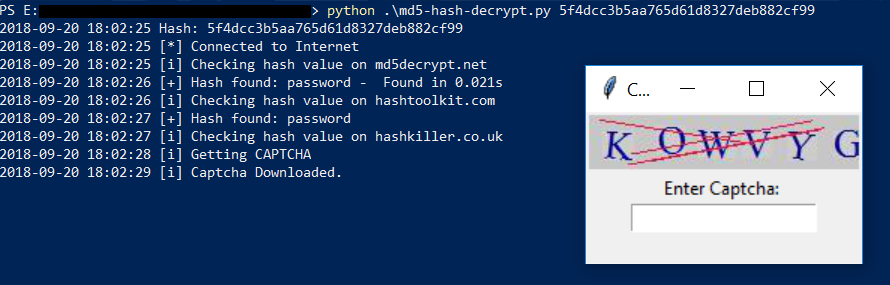
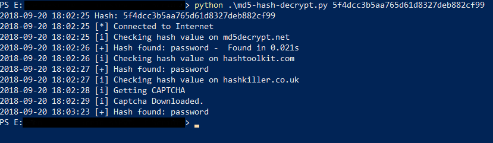

# md5-hash-decrypt
Reverse Lookup of md5 hash on online databases

The script will reverse lookup md5 value on md5decrypt.net, hashtoolkit.com and hashkiller.co.uk
However for hashkiller.co.uk captcha is required to submit request. A popup box to fill captcha will be generated.

## Prerequisites:
- python 3

## Installation:
Run the below command to get the required python3 packages.
```
python -m pip install -r requirements.txt
```

## Usage:
```
python md5-hash-decrypt.py <md5-hash>
```
###### Example:
```
python md5-hash-decrypt.py 5f4dcc3b5aa765d61d8327deb882cf99
```

For checking hash value on hashkiller.co.uk captcha is required. A popup box will be generated where user needs to enter captcha and press enter.

## Output:


